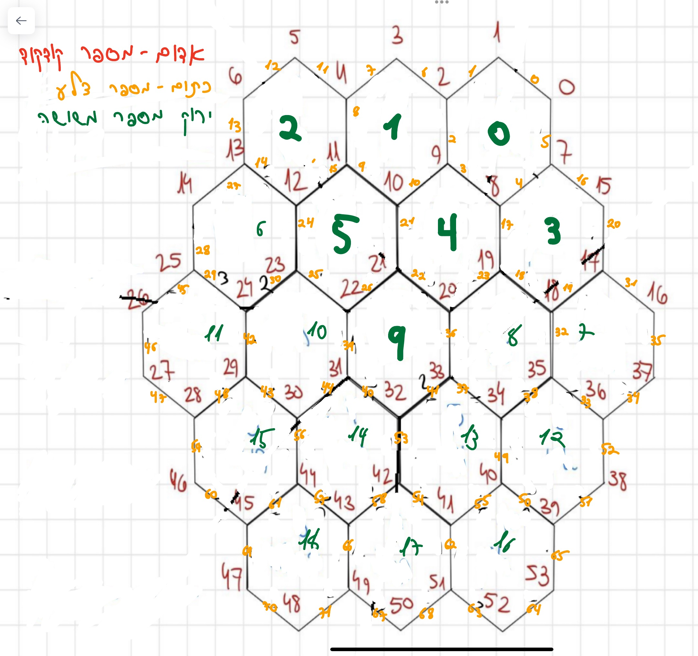

## Catan

The Settlers of Catan is a board game for 3 to 4 players that combines strategic thinking, resource management, and trading skills. The goal of the game is to be the first to accumulate 10 victory points. The complete game rules can be found [here](https://www.hakubia.com/wp-content/uploads/2021/01/%D7%A7%D7%98%D7%90%D7%9F.pdf). In this task, a simplified version of the game for 3 players has been implemented.

## Game Rules
The game consists of a board with 19 land plots surrounded by the sea. Each land plot provides a specific resource (except for the desert). The land plots in the game are: Forest (produces wood), Hills (produce bricks), Pasture (produces wool), Fields (produce grain), Mountains (produce ore), Desert (produces nothing). Each land plot on the map is assigned a number between 2 and 12.

### Cards, Settlements, Cities, and Resources
Each player has resources (such as grain, ore, bricks, etc.) that can be used to purchase various items in the game such as development cards, settlements, cities, and roads.

- **Development Card**: The cost of a development card is 1 ore, 1 wool, and 1 grain. The player can receive one of 3 different types of cards:
  1. **Advancement Card**: This card provides a benefit to the player (after which the card is discarded). Examples include:
    - Monopoly: The player chooses a resource, and all other players must give them this resource.
    - Road Building: The player can build 2 roads on the map at no cost.
    - Year of Plenty: The player receives two resource cards of their choice from the bank and can use them in the same turn.
  2. **Knights**: A player holding 3 of these cards receives the largest army card, granting them 2 victory points (unlike the regular rules, there is no option to rob another player and use the robber).
  3. **Victory Point Cards**: There are 5 different cards that grant a victory point to the holder.

- **Building**: Players can build roads, cities, and settlements as follows:
  1. **Road**: Costs 1 brick and 1 wood. A road segment can only be connected to a player's settlement (or city) or another road segment.
  2. **Settlement**: Costs 1 brick, 1 wood, 1 wool, and 1 grain. A settlement can be built on an intersection connected to at least one road segment and at least two road segments away from another settlement. Building a settlement grants the player one victory point.
  3. **City**: A city can replace an existing settlement. The cost is 3 ore and 2 grain. When upgrading a settlement to a city, the player loses the settlement's victory point but gains 2 points for the city. A city grants the player double the resources from all adjacent land plots.

- **Resources**: Resources are obtained from the various land plots. When a player rolls the dice, all players receive resources based on the number rolled (e.g., if a 3 is rolled, players with settlements/cities adjacent to land plots with the number 3 receive the resource).

- **Trading**: Players can trade with each other (i.e., exchange cards or resources) as they see fit.

### Game Play
Each player starts the game with 2 settlements and 2 road segments, granting them 2 victory points. Additionally, players receive initial resources based on the locations of their settlements (one resource of each possible type). The turn order is player 1, 2, and 3. Each turn, players roll 2 dice. Based on the roll result, players receive resources as described earlier.

On a given turn, a player can:
- Trade (exchange cards or resources).
- Build roads, settlements, or cities, and buy development cards.

If the dice roll is 7 (except in the first two rounds where rolling a 7 is not an option), all players with more than 7 resource cards must choose half of their cards and return them to the deck.

### End of the Game
The game ends when a player reaches 10 or more victory points during their turn. To win, the player must have at least 10 points when their turn begins.

### Changes from the Original Game
- The game is only for 3 players.
- Each player starts with 2 settlements and 2 road segments.
- Each player receives initial resources based on the locations of their settlements.
- The turn order is players 1, 2, and 3.
- Players can trade, build, and purchase development cards without limits on quantity or time.
- Players can build settlements and cities at the specified costs.
- Players can purchase development cards at the specified costs.
- There is no use of the knight card.
- There is no option for trading with the bank.

